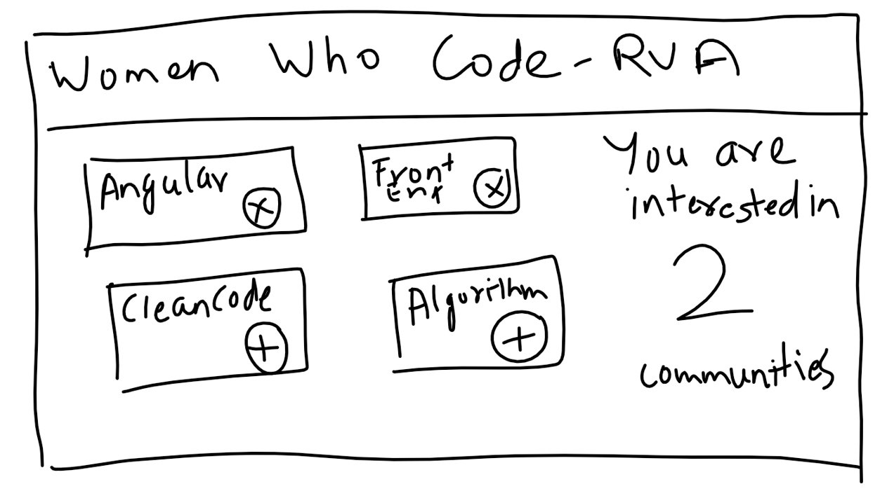

# Requirements for Component Exercise
<ul>
  <li> 
    Application should list Women Who Code Communities
  </li>
  <li>
   Community component should display community name and allow user to add or remove to their interest. 
  </li>
  <li>
    Parent component should react to user’s interest selection. Here are few suggestions.
    <i>-	Display number of communities users are interested in</i>
<i>	Style interested and not interested communities differently</i>

  </li>
 </ul>

